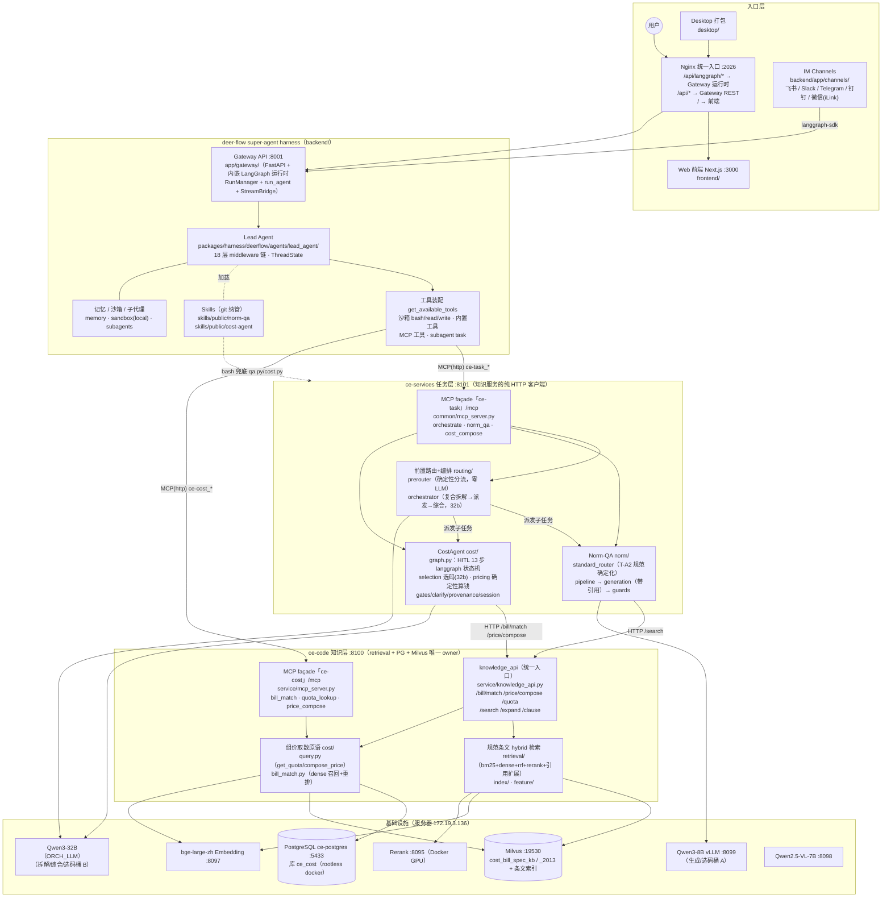
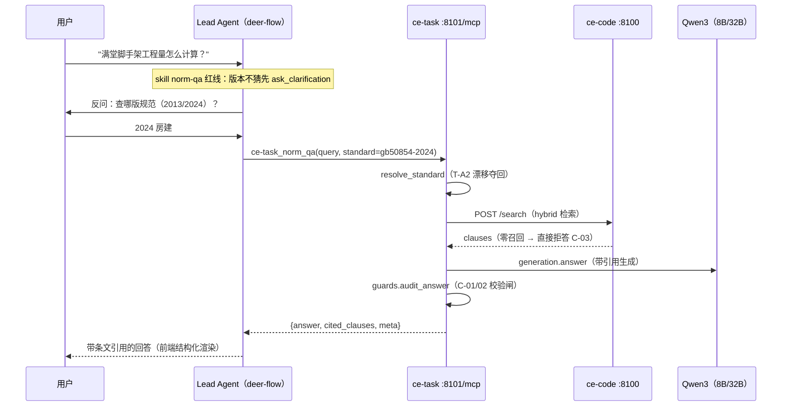
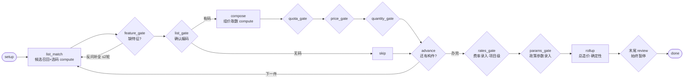
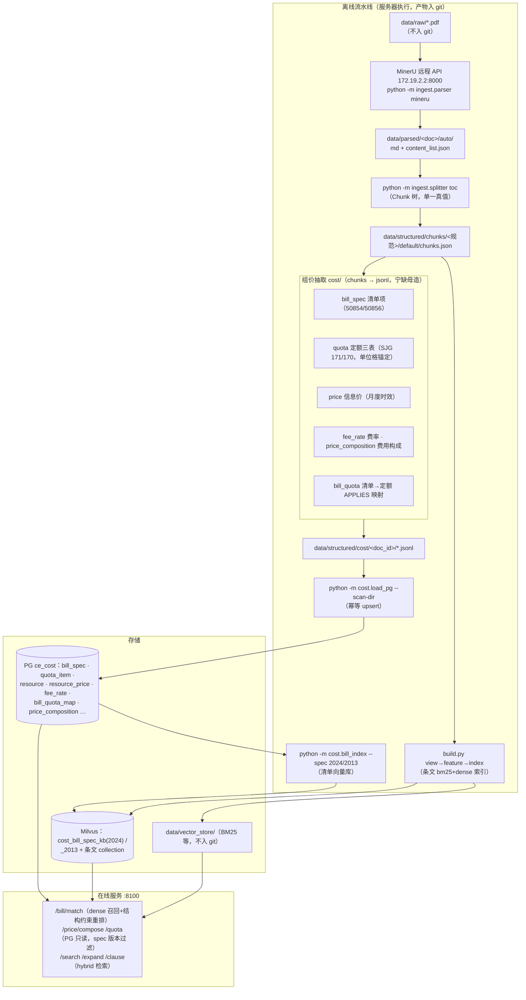

# AGENT_ARCHITECTURE · 技术架构图

> 依据仓库实际代码（2026-07）绘制：deer-flow super-agent harness（`backend/` + `frontend/`）+ 建筑领域三层（`ce-services/` 任务层 → `ce-code/` 知识层 → 基础设施），以及数据流水线与评测环。各图均标注对应源码位置。

---

## 1. 全景拓扑



**分层铁律**（代码中强制）：

| 边界 | 规则 | 落点 |
|---|---|---|
| harness ↔ app | `app.*` 可 import `deerflow.*`，反向禁止 | `backend/tests/test_harness_boundary.py`（CI） |
| 任务层 ↔ 知识层 | ce-services 是**纯 HTTP 客户端**：不 import retrieval、不连 PG/Milvus | `ce-services/common/{knowledge_client,cost_client}.py` |
| 存储 owner | retrieval + PG + Milvus 只有 ce-code 一个 owner | `ce-code/service/knowledge_api.py` |
| 国标版本隔离 | `spec`（2013/2024）必填无默认，缺省 → 400；PG 复合主键 `(code, spec_version)`、每版本独立 Milvus collection | `ce-code/config.py SPEC_REGISTRY` + `cost/schema.sql` |
| LLM 不算钱 | 组价/汇总为确定性公式 + pydantic 闸门，LLM 只做选码/拆解/综合 | `ce-services/cost/pricing.py` |
| 弱模型不驱动流程 | 能力分流用确定性规则（零 LLM）；是否停闸由服务端图决定 | `ce-services/routing/prerouter.py` · `cost/graph.py` |

---

## 2. Agent 调用链（deer-flow → CE 能力）

领域能力通过 **skill（提示词导引）+ MCP 工具（结构化执行）** 双通道接入 lead agent，注册于根 `extensions_config.json`：



**两个 MCP façade 的分工**（均为 FastMCP streamable-HTTP、复用编排/取数内核、不反代自家 REST）：

| Server | 挂载 | 工具 | 性质 |
|---|---|---|---|
| `ce-cost` | :8100/mcp（`ce-code/service/mcp_server.py`） | `bill_match` / `quota_lookup` / `price_compose` | 纯数据原语，无状态只读，红线下沉到原语边界 |
| `ce-task` | :8101/mcp（`ce-services/common/mcp_server.py`） | `orchestrate` / `norm_qa` / `cost_compose` | 带 LLM 编排的任务能力，无状态一把出结果 |

有状态的 HITL 组价会话**不走 MCP**——由前端 `cost-hitl` marker 卡片直连 :8101 session 端点驱动（见 §3）。

---

## 3. CostAgent HITL 状态机（ce-services/cost/graph.py）

独立 langgraph 图，可中断可恢复，每步带 provenance；compute（含 LLM，checkpoint 保证只跑一次）与 gate（幂等 interrupt）双拆，避免 resume 重跑 LLM 漂移：



对外三端点（`cost/router.py`）：`POST /cost/session/start`（跑到首闸）→ `POST /cost/session/{id}/resume`（带用户决策续跑）→ `GET /cost/session/{id}/state`（钉码/override/audit_log 持久化）。另有无状态旧路 `POST /cost/compose`（一次性选码+取数）与确定性原语 `/cost/unit-price`、`/cost/rollup`。

---

## 4. 知识层数据流水线（ce-code，离线 → 在线）



---

## 5. deer-flow harness 内部（backend/，上游框架）

```
Gateway :8001（app/gateway/，FastAPI）
 ├─ 内嵌 LangGraph 运行时：RunManager + run_agent() + StreamBridge（SSE）
 ├─ REST routers：models / mcp / skills / memory / uploads / threads / artifacts / feedback / channels …
 └─ Lead Agent（make_lead_agent）
     ├─ 中间件链（18 层，严格顺序）：ThreadData → Uploads → Sandbox → DanglingToolCall
     │   → LLMError → Guardrail → SandboxAudit → ToolError → Summarization → TodoList
     │   → TokenUsage → Title → Memory → ViewImage → DeferredToolFilter → SubagentLimit
     │   → LoopDetection → Clarification（必须最后，拦 ask_clarification 中断）
     ├─ 工具：沙箱(bash/ls/read/write/str_replace，虚拟路径 /mnt/user-data) · 内置(present_files/
     │   ask_clarification/view_image) · MCP(lazy+mtime 失效) · 社区(tavily/jina/firecrawl) · task 子代理
     ├─ 模型工厂：create_chat_model（vLLM VllmChatModel，Qwen thinking 开关；本项目 agent 用 qwen-plus，
     │   Qwen3-8B function-calling 不可靠）
     ├─ 记忆：per-user memory.json（debounce 30s，LLM 抽取事实）
     └─ 追踪：Langfuse/LangSmith（graph 根挂 callback，run_id → 确定性 trace_id → 用户反馈回流打分）
```

---

## 6. 评测环（benchmark/，项目根）

| 组件 | 内容 |
|---|---|
| `benchmark/routing_eval/` | 路由/澄清金标（prerouter · standard_router · orchestrate 分流） |
| `benchmark/retrieval_eval/` | 清单匹配 / 条文召回金标（`ce-code/tools/eval_bill.py`：Top-1/3、Recall@k、MRR） |
| `benchmark/runner/` | Langfuse Datasets 上传 + `run_routing_experiment.py`（dataset.run_experiment 从 agent tool calls 打分） |
| `ce-services/tools/` | `benchmark.py` / `eval_select.py` 选码评测 / `prerouter_eval.py` / `standard_router_eval.py` |

评测经 Langfuse trace（`langfuse_session_id=thread_id`，prompt-variant 打 tag）与线上流量同环观测。

---

## 7. 端口与部署速查

| 端口 | 服务 | 归属 |
|---|---|---|
| :2026 | Nginx 统一入口（`/setup` 首启建管理员） | deer-flow |
| :3000 | Next.js 前端 | deer-flow |
| :8001 | Gateway API + LangGraph 运行时 | deer-flow |
| :8100 | 知识服务 knowledge_api（REST + `ce-cost` MCP） | ce-code（裸机 CPU，先起） |
| :8101 | 任务服务 main.py（REST + `ce-task` MCP） | ce-services（裸机 CPU） |
| :8095 | Rerank（Docker GPU，sudo daemon） | 基础设施 |
| :8097 / :8098 / :8099 | Embedding / VLM / Qwen3-8B vLLM | 基础设施 |
| :5433 | PG ce-postgres（rootless docker，库 ce_cost） | 基础设施 |
| :19530 | Milvus | 基础设施 |
| :19090 | Prometheus（+ Grafana 监控栈，`docker/`） | 运维 |

启动顺序：基础设施（PG/Milvus/vLLM）→ 知识服务 :8100 → 任务服务 :8101 → deer-flow（`make dev`）。后台常驻用 `setsid`/tmux，勿用 nohup。
