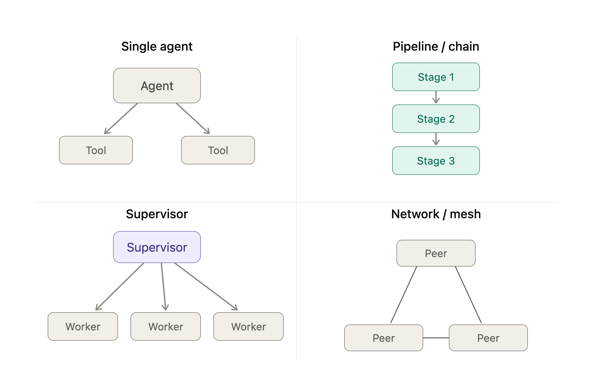

# 简要介绍一下这个项目
这是一个AI报价助手，针对的是建筑场景。简要说明业务过程：


# 项目采用什么 agent 架构？为什么选用这个架构？选了什么模型、原因是什么？

> 本项目 = **深圳房建成本预算 Agent**（组价 + 规范问答）。下为面试可背版。

## 一、采用什么架构

**四层骨架：确定性前置路由 → 工具化能力层 → 校验闸 → 复合编排器。**

```
请求 → ① 前置路由(确定性,无LLM)：能力分流(组价/规范/价格) + 形态判定(单/复合·特征缺·口径缺) + 规范映射(计量→GB50854/计价→GB50500)
        │单一                                    │复合
        ▼                                        ▼
     ② 能力层(工具)：RAG接地生成 / 置信门控选码 / 取数 / 确定性算钱   ④ 复合编排器：拆解→子任务回①→综合
        ▼
     ③ 校验闸(无LLM)：溯源必带 / 无命中即拒 / 口径纯净
        ▼  结构化卡(依据可见)+答案
```

用四维框架描述（见下文§一）：**低 autonomy（workflow 为主干）+ orchestrator-workers 拓扑 + 局部 ReAct 反馈循环（仅特征/口径澄清）+ plan-ahead 为主、interleaved 仅在复合拆解**。不是全自主 ReAct agent。

## 二、为什么选这个架构（核心：被需求强制，不是偏好）

项目有五条不可协商的红线：**C-01 全量溯源（100%）、C-03 空结果不幻觉、C-04 数值计算不进 LLM、路由正确率≥95%、延迟 NFR**。这几条**数学上就排除了"让大模型自由编排"**：

- C-01/C-03 ⟹ 必须 **RAG 检索接地 + 校验闸**（纯参数化生成必然编造条款号）；
- C-04 ⟹ 数值必须交**确定性计算工具**（LLM 算钱不可信）；
- 路由≥95% + 延迟 ⟹ 路由用**确定性分类器**（不靠弱模型判断，又快又稳）；
- 多步/复合 ⟹ 需 **orchestrator 拆解**。

所以正确性被"工具 + 闸 + 确定性路由"夹住，**LLM 只在窄槽出力**（受限生成、候选消歧、澄清、复合综合）。一句话:**这是"workflow 主干 + 关键节点确定化"的架构，因为造价场景容错率低、要可审计可溯源，全自主 agent 在这里是负债不是资产。**

> 反例教训：曾让 LLM 自由选规范，结果把"按什么计量"路由到计价规范(GB50500)而非计量规范(GB50854)——故把"问题类型→规范"做成确定性映射(①层),从弱模型手里夺回。

## 三、选什么模型、为什么（分层，不是单选）

可选 Qwen3-**8B** / **32B**。需求在「推理难度 × 延迟」上**双峰**，单一模型满足不了 → **分层**：

| 桶 | 任务 | 模型 | 原因 |
|---|---|:--:|---|
| A 接地/检索 | 规范问答生成、高置信选码、取价、澄清 | **8B** | 高频 + 延迟紧（FR-K≤3s）；正确性靠工具/闸兜住、与模型大小无关，只需快 |
| B 推理 | 复合比选/结算、漏项错套、复合拆解、**选码消歧** | **32B** | 真·推理，8B 给不出可信结论；低频、5s 预算宽 |

关键论点（面试加分）：

1. **延迟是单请求 per-token 速度决定的，加 GPU 解决不了**——32B 跑带引用生成必超 3s，故高频的规范问答**只能用 8B**，与 GPU 多少无关。
2. **正确性不靠模型大小，靠架构**——8B 也能 100% 溯源、不幻觉，因为有 RAG + 校验闸；模型大小只影响"推理质量"，不影响"红线达标"。
3. **GPU 充足时**，把 32B 砸在 8B 最不可靠、又最烧钱的槽：复合推理 + **选码候选消歧**（区分现浇/预制、矩形柱/构造柱，选错=报错价）。
4. **若只能起一个模型 → 选 8B**：它守住全部红线 + 延迟 NFR，只在"可降级、允许拒答给出路"的高阶推理上让步；32B-only 反而结构性违反高频路径的延迟。

> 一句话总结："**架构让弱模型也能合规，所以默认 8B 扛高频；32B 只点在真吃推理、又允许慢一点的低频槽上。**"

---

# Agent有哪些架构？做架构选型时要考虑哪些因素？
Agent 架构选型最容易踩的坑,是把"有哪些架构"理解成一个扁平清单(ReAct、multi-agent、RAG……),然后纠结挑哪一个。
但这些东西其实不在同一个维度上——ReAct 是反馈循环的形态,multi-agent 是拓扑的形态,二者可以叠加。
所以正确的心智是:架构 = 几个正交维度的组合,你不是在选一个,而是在每个维度上各定一个值。

下面先给维度框架(这是面试真正想听的),再给拓扑可视化,最后给选择因素和你的 EPC 映射。
一、四个正交维度(决定架构形态的轴)
这四个维度正交,任意组合都是一种合法架构:
Autonomy(自主度):从 Workflow(预定义路径、LLM 只填空)到 Agent(LLM 动态决定下一步)。这是 Anthropic Building Effective Agents 的核心区分——大多数生产系统其实是 workflow,不是全自主 agent。
Topology(拓扑):单 agent / 链式 / supervisor / 分层 / 网状。决定"几个 LLM 角色、谁连谁、信息怎么流"。
Feedback loop(反馈循环):有没有 observe-act 循环(ReAct)、有没有 reflection / self-critique(evaluator-optimizer)。决定 agent 能不能根据执行结果纠偏。
Task decomposition timing(任务分解时机):plan-ahead(先规划全局再执行,可控、可审计)vs interleaved(边做边分解,ReAct 式,灵活但难预测)。
把一个系统在这四轴上各取一个值,就完整描述了它的架构。比如你的 ReAct 子节点 = 高 autonomy + 单 agent topology + 有 feedback loop + interleaved 分解。

二、Topology 维度的几种典型形态
拓扑是四个维度里最"空间化"的,画出来比文字清楚——谁是协调者、信息往哪流:
  ::view-transition-group(*),
  ::view-transition-old(*),
  ::view-transition-new(*) {
    animation-duration: 0.25s;
    animation-timing-function: cubic-bezier(0.19, 1, 0.22, 1);
  }

VvisualizeVvisualize show_widget几点说明:链式确定、可审计但不灵活;supervisor(= orchestrator-workers)是多 agent 生产系统最常用的形态,协调权集中、好调试;网状(swarm)peer 之间自由通信,灵活但状态共享和可观测性极差,生产环境慎用;分层(图里没画)= supervisor 的 supervisor,适合任务可分解成多层子任务的大系统。

三、常见架构模式 = 维度的具体组合
业界叫得出名字的"架构",本质都是上面维度的固定组合:
Workflow 类(低 autonomy,推荐做主干):Prompt chaining(链式)、Routing(分类后分流)、Parallelization(并行+聚合)、Orchestrator-workers(动态分派但路径受控)、Evaluator-optimizer(生成-评估循环)。
Agent 类(高 autonomy):ReAct(单 agent + reason-act-observe 循环 + interleaved 分解)、Plan-and-execute(先规划后执行 = plan-ahead)、Multi-agent(supervisor / hierarchical / network)。

四、如何根据业务场景选——核心因素
因素倾向确定性 Workflow倾向自主 Agent任务可预测性路径固定、步骤已知开放探索、路径不可预知错误容忍度 / 合规高风险、需审计、要 human-in-the-loop可容错、结果可回滚任务复杂度步骤少、无需动态分解需运行时分解、子任务数量不定延迟 & 成本敏感(workflow 步数可控)可接受 loop 放大的开销可观测 / 可调试要求高(拓扑越简单越好查)团队有能力处理 multi-agent 调试上下文压力单上下文够用子任务需隔离 context → 多 agent / 分层
贯穿一切的第一原则(Anthropic 的核心建议):用能 work 的最简单架构,只在收益明确时才加复杂度。多 agent / 网状不是更高级,而是更贵、更难调、更不可控——能用 routing + 单 agent 解决就别上 supervisor。
五、落到你的 EPC 系统
你的 Orchestrator-Pipeline-ReAct 三层,正是"按节点在四个维度上分别取值"的范本,而不是单选了某一种架构:

Orchestrator 层:topology = supervisor / routing,autonomy 中等。负责把请求分给组价或规范问答,集中协调、好审计——符合政企造价场景对可控可追溯的硬要求。
Pipeline 层:autonomy 低、plan-ahead、链式。造价流程(清单解析→量价匹配→取费)步骤相对固定,用确定性 workflow 做主干最稳,合规和可调试都占优。
ReAct 层:只在真正需要工具循环和动态推理的子任务(如组价的歧义边缘 case)才上高 autonomy + interleaved。配合你的 confidence-threshold,高置信项走确定性短路,LLM 循环只留给少数难项——这正是"最简架构优先"的体现。

面试时如果被追问"为什么不做成全 multi-agent",最有力的回答就是:造价业务的可审计性和确定性需求,使得 workflow 主干 + 局部 ReAct 比全自主 multi-agent 更合适——把这句话和上面四维框架绑在一起讲,会比罗列架构名词有说服力得多。

# Workflow(预定义路径、LLM 只填空) 对比 Agent(LLM 动态决定下一步)
这句话的本质只有一个区分维度:谁掌握控制流(control flow)——也就是"下一步做什么"是由谁决定的。其他差异都是这一点的衍生。
Workflow 端:开发者把流程图写死在代码里。LLM 只在固定节点上被调用,负责产出一个值——分类一个类别、抽取字段、生成一段文本,这就是"填空"。但"填完空之后走哪条边",是代码里的 if-else / 固定 edge 决定的,LLM 不掌握控制权。
Agent 端:开发者只给 LLM 一组工具和一个目标,不预设路径。LLM 每一步自己决定:调哪个工具、填什么参数、拿到结果要不要再来一轮、什么时候算完成。控制流是 LLM 在运行时生成出来的,而不是开发者提前写好的。
而且这不是二选一,是一条连续谱:越往右越灵活,能处理预料外的情况;但也越不可预测、loop 成本越高、越难调试和审计。中间的 Routing 是个很好的折中点:LLM 决定走哪个分支(让渡一部分控制权),但分支集合是你预定义的(控制权没完全放手)。

用你自己的组价场景做对比,这个区别会立刻具体起来——同一个任务,两种做法:
- Workflow 版组价(控制流在代码里):
解析清单项 → 规则/embedding 匹配定额
   → if 置信度高: 直接取费输出
   → else: 调 LLM 兜底节点产出候选定额 → 输出
LLM 只出现在"兜底节点",负责产出候选定额——这是填空。要不要调它、调完走哪条边,全是代码写死的。这恰好就是你的 confidence-threshold 设计:默认把控制权握在代码手里。
- Agent 版组价(控制流由 LLM 生成):
工具集 = [查定额库, 查 SJG 规范, 算工程量, 取费计算]
指令 = "完成这条清单项的组价"
LLM 自己决定:先查定额库 → 发现描述歧义 → 主动去查规范澄清 → 再算量 → 取费 → 收敛输出。每一步选择都是它当场判断的,你没有预设这条路径。
两边做的是同一件事,差别只在那条路径是你写死的、还是 LLM 即时决定的。这就是从 Workflow 到 Agent 的全部含义。
这也直接解释了你上一轮那个三层架构的取舍——造价业务要可审计,所以主干用 workflow 把控制权握在代码里,只在歧义项上把控制权让渡给 ReAct。你不是在"用不用 agent"之间二选一,而是在这条谱上为每个节点选了一个合适的位置。

# 如何根据Agent项目选择相合适的开源模型？要考虑哪些因素？要考虑模型的哪些指标？
因素是你关心的维度,指标是你拿什么去量它。三者的关系是 流程(怎么选)→ 因素(看什么)→ 指标(怎么量)。
一、选型流程(回答"如何选")
开源 Agent 选型不是"挑一个最强模型",而是一套可操作的收敛流程:
拆节点:把系统拆成角色(Orchestrator / 各 sub-agent / triage),逐节点定义能力需求 + SLA(准确率、延迟、成本上限)。Agent 选型的前提是承认异构选型——不同节点用不同模型。
硬约束先过滤:License、私有化/合规、硬件预算这些"过不了就出局"的条件,在比性能之前就把候选集砍小。
强模型立上界:先用阵营里最强的开源模型跑通整条链路,确立质量天花板。
逐节点向下降级:用你自己的 eval set 验证哪些节点降级后质量不掉——这是省 GPU 成本的主战场。
叠工程优化:量化、prompt caching、confidence-threshold 短路、非 LLM 路径。
量化后 + 你的 eval 终判:leaderboard 只圈候选,不定胜负。

二、因素 → 指标 映射(回答"看哪些因素 / 哪些指标")
因素维度具体指标怎么量(benchmark / 测法)License 合规商用许可、权重开放度、蒸馏/再训练限制直接读协议;优先 Apache 2.0,避开带 MAU 上限的自定义协议Tool calling工具选择/参数填充准确率、schema 合法率BFCL、τ-bench;并确认推理引擎有对应 tool parser长上下文有效性effective context(非标称窗口)、中段衰减RULER、大海捞针,而非看 nominal window指令遵循/结构化输出JSON 合法率、字段约束遵循度IFEval;用你 Pipeline 节点间真实传参测推理深度多步规划、ReAct 反思质量只在需要的节点测;注意 reasoning model 的 thinking token 成本幻觉率/grounding忠实度、引用准确性用你的规范问答样本测复述忠实度(对 规范问答 agent 最关键)部署门槛总参数 vs 激活参数、VRAM、KV cacheMoE 看 active params;按 参数×精度 + KV cache 估显存量化友好度量化后关键能力损失FP8/INT4、AWQ/GPTQ;重点测量化后 tool calling 掉不掉Serving 经济性tokens/s/GPU、并发承载vLLM/SGLang 实测吞吐,而非看 token 单价可演进性微调友好度、社区动能是否支持 LoRA/QLoRA;release 节奏、HF 衍生版丰富度中文+领域中文规范文本理解/复述国产模型优先;用你的规范文本自测
这张表的核心逻辑:通用分数(MMLU/GSM8K)对 Agent 几乎没参考价值,真正决定成败的是右侧那几个 Agent 专用指标,而它们大多在模型 README 里不会被强调。
三、开源相对闭源,额外多出来的三件事
如果面试官追问"开源和闭源选型有什么不同",这三点是区分度所在——它们本质都是自托管把推理服务的运维负担接了过来才浮现的:

License 成了第一过滤器(闭源不用关心,开源法务真会看)
真实成本从 token 单价变成 GPU TCO(VRAM + tokens/s/GPU + 并发)
可演进性成了红利(能微调、能改,这是选开源的核心理由,要主动算进价值)

四、落到你的 EPC 系统
三条硬约束(政企合规 + 中文 + Apache 2.0)基本把候选收敛到 Qwen / DeepSeek / GLM 阵营。
Orchestrator 用大 MoE(强推理,省钱不划算);组价 agent 用中端 dense/小 MoE + 强 tool calling,配 confidence-threshold 把高置信项挡在 LLM 外;规范问答 agent 选低幻觉 + 长上下文忠实的;triage 用小模型甚至 embedding。
你已生成的两个 agent 测试数据,正好做成 eval harness,让第 4、6 步从"看榜"变成"看你自己的数"。

# lead_agent 该派 subagent 的四个场景(核心判据)
派不派,就看子任务是否同时满足"上下文重 + 能自洽 + 不需中途问用户 + 值得隔离/并行":
1. 上下文噪音大,会撑爆/带偏父对话
过程产生大量中间输出(读几十文件、翻日志、反复试错),父只要结论。子在隔离 context 里折腾,只回摘要。
2. 可并行的同类独立任务
多个互不依赖的子任务,同时派(≤3)。例:一张清单几十个构件批量取数,各自独立。
3. 任务自洽、能一句话说清、不需中途澄清
因为子被禁了 ask_clarification,发出去就得能独立干完。
4. 探索/广撒网类
"全库找用了 X 的地方""调研某主题"——读得多、结论短。
不该派(反过来记)
- 需要中途问用户(子不能澄清)
- 任务短/便宜(起后台线程+轮询不划算)
- 要紧密来回
- 要给用户展示文件(子被禁 present_files)
- 强依赖父的完整对话历史

# 简述提示词工程及项目中的调优方法

# skill、tool、mcp、acp、subagent,解释它们的概念、联系和区别
最好从agent的发展来讲

# 哪些工具适合用 tool_calling，哪些适合封装在skill中用bash，谈谈你的看法
deer-flow 用 tool_calling 真正暴露的工具（全是原语）：bash / ls / glob / grep / read_file / write_file / str_replace（文件&shell 原语）+ ask_clarification / present_file / view_image / task(subagent) / setup_agent / update_agent（harness 控制原语）+ MCP 工具 + tool_search（延迟加载）。
skills/public 里 23 个 skill：全部是「SKILL.md 说明书 + 脚本/HTTP 调用」，靠 bash 一条命令拉起。

我的核心判据

决定一个能力放 tool_calling 还是封进 skill，我看 6 个轴：

┌────────────────────────────┬────────────────────────┬────────────────────────────────────────┐
│             轴             │   倾向 tool_calling    │            倾向 skill+bash             │
├────────────────────────────┼────────────────────────┼────────────────────────────────────────┤
│ 通用性/频率                │ 几乎每个任务都用的原语 │ 特定领域、偶发                         │
├────────────────────────────┼────────────────────────┼────────────────────────────────────────┤
│ 参数复杂度                 │ 少、扁平、schema 稳定  │ 多参数 / 需读参考文档才能填对          │
├────────────────────────────┼────────────────────────┼────────────────────────────────────────┤
│ 同类变体数量               │ 单一动作               │ 一引擎 N 变体（如 26 种图表）          │
├────────────────────────────┼────────────────────────┼────────────────────────────────────────┤
│ 是否含「怎么用」的流程知识 │ 单步原子动作           │ 多步 playbook（inspect→query→summary） │
├────────────────────────────┼────────────────────────┼────────────────────────────────────────┤
│ 状态/编排                  │ 无状态                 │ 自带状态、跨调用缓存、内部编排         │
├────────────────────────────┼────────────────────────┼────────────────────────────────────────┤
│ 上下文预算                 │ 常驻也不贵             │ 渐进披露、按需读 references 才划算     │
└────────────────────────────┴────────────────────────┴────────────────────────────────────────┘

对照 skills/public 的归类

这些就该是 tool_calling（现状正确）：bash、文件读写、grep/glob——原子、通用、schema 稳定、天天用；ask_clarification / present_file / task 是 harness 控制流原语，也对。

这些天然该是 skill（封 bash），理由各不同：
- chart-visualization：26 种图表各自一套 schema。若每种都做成 tool_call，工具列表直接爆炸、每轮都烧 token。收成 1 个 skill + references 按需读，是教科书级的正确选择。
- data-analysis：多步 + 有状态（DuckDB 缓存跨调用复用）。脚本自己 own 编排和 .cache/ 目录，比让模型连发 N 个工具调用稳。
- ppt / podcast / video / image-generation：重型外部流水线 + 大量参数，封脚本合适。
- deep-research / github-deep-research / systematic-literature-review / consulting-analysis / newsletter / academic-paper-review / code-documentation：本质是长流程方法论，知识写进 prose 比塞进 JSON schema 自然。
- frontend-design / web-design-guidelines：几乎是纯知识，没有真正的"调用"，skill 就是一份会被触发加载的指南。
- norm-qa / cost-agent（你们自己的）：包了对 :8100/:8101 的 HTTP 调用——这是最值得讨论的边界情况，下面单说。

关键 insight：skill 没有逃离 function-calling，只是把它"降级"了

skill 最终还是靠 bash 这个 tool_call 拉起的。所以它的真正价值不是"绕开工具机制"，而是把一次"复杂嵌套 JSON args 的 tool_call"换成一次"bash + 命令字符串的 tool_call"。

这对你们尤其重要：你 memory 里记着 Qwen3-8B function-calling 不可靠。回忆上轮拆的 _parse_input 那道 pydantic 闸门——模型生成一条 shell 字符串，比生成一个深层嵌套、会被 schema 严格校验的 args 对象，成功率高得多。所以在弱模型上，「能力越复杂 → 越该封进 skill」不只是工程整洁，是直接提调用成功率。

但 skill 的代价：丢了那道闸门

反过来，skill 走 bash 也付出了 tool_calling 的两个好处：
1. 没有 args_schema 校验——错误以 bash 失败的形式暴露，模型可能拼出畸形命令；
2. 没有结构化 guardrail——安全面变成了 shell。

所以凡是需要强校验/强护栏的能力（破坏性操作、写生产、严格枚举参数），我更倾向做成带 args_schema + 你自己 guardrail 的真工具，而不是 skill。

给你们 ce-* 的具体建议

norm-qa / cost-agent 现在是 skill，我认为这个选择对，但理由要清楚：它对，是因为它们除了"调一下 :8100"还携带大量领域流程知识（选哪个 spec 版本、怎么组织带引用的回答、9 位编码怎么在候选内选），这些是 prose 才装得下的；而且弱模型下少绑工具更稳。

但底层那次纯检索（:8100 的召回）其实参数扁平、schema 稳定、未来审图/FM/算量都要复用——这正好命中 tool_calling 的甜区。我的建议是分层：

- 把 :8100 检索做成一个薄的、schema 清晰的 MCP 工具（带校验、跨 agent 复用），这是 BIM 那条"横切共享底座"思路在工具层的延续；
- norm-qa / cost-agent 这层 skill 保留方法论与编排，内部可以调那个 MCP 工具，也可以继续 curl——但领域知识留在 skill。

一句话收尾我的看法：原子、通用、需要校验/护栏的 → tool_calling；多变体、多步、富流程知识、重型外部流水线的 → skill。 在 Qwen-8B 这种弱 function-calling 模型上，这条线还要再往 skill 那边挪一点，因为"一条 bash 字符串"比"一个合 schema 的嵌套 args"好生成得多。

# 在项目中如何对用户的意图进行有效的识别，考虑哪些因素？
规则优先、LLM兜底，原因：
1. 意图空间极小、判别词高度领域化。不是通用闲聊分类（那种才必须上模型），是窄域术语判别，正则/关键词命中率会很高。真正要路由的就 norm vs cost 两条道，而且两边的触发词在造价领域几乎不重叠：
  - norm 侧：计量规则、工程量计算规则、项目特征、按什么计算、综合单价包含哪些费用、条文、规范怎么规定……
  - cost 侧：组价、套定额、套什么清单码、9 位编码、工料机含量、信息价……
2. 确定性 + 可测试，正好踩中你们的工程约定。后端是强制 TDD 的。规则路由可以写 test_intent_router.py，喂一批 query 断言路由结果——而 LLM 路由你没法稳定测（同样输入可能飘）。你们 prompt 里那一堆"死命令模板/红线"本身就是"能确定就别交给模型"的哲学，路由用规则是一致的。
3. 不给弱模型增加新的失败面。你自己记忆里就记着 Qwen3-8B function-calling 不可靠。让它多做一步"先分类"，等于又押注它的弱项。规则路由是把这个决策从模型手里拿走，反而更稳。
4. 零延迟、零 token 成本、可解释。分错了能直接看是哪条规则命中的，改一行就行；模型分错你只能调 prompt 再赌。

编码会在哪卡住（所以不能纯规则）
1. 裸描述 / 无动词的输入。用户直接贴 "C30 现浇矩形柱"，没有任何疑问词——他是想查计量规则还是想组价？规则只能靠"默认值"猜（合理默认：裸构件描述→cost）。这能兜住大部分，但总有歧义残留。
2. "信息是否充分"这一步规则做不了。判断"构件描述够不够细以致要不要 ask_clarification"是语义判断，关键词命中不了。不过——这一步本来就不该规则化，交给 ask_clarification 的现有流程即可，和意图路由解耦。

# Human-in-the-loop 有哪些形式？我的项目为什么选这个形式？
答这题的框架：先给分类维度（显示有体系），再精准定位自己的选择，最后用业务约束解释为什么——别罗列名词。

一、HITL 的形式（按三个维度切，不要零散举例）
维度 1 · 介入时机（什么时候问人）：
- 前置/审批式（pre-approval）：执行高风险动作前停下等批准。典型 = Claude Code 执行 bash 前的确认弹窗。
- 过程/编辑式（in-the-loop editing）：流程中途让人修正中间结果再继续（改草稿、调候选）。
- 事后/审核式（post-hoc review）：系统先全自动产出，人最后复核签字或抽检。
维度 2 · 介入粒度（问多少、怎么问）：
- 逐步停走（stop-and-go）：一次只问一个决策点，确认完再走下一个（Claude Code 式）。
- 批量表单（batch form）：开局把所有待定项列成一张表，填完一次性 submit。
- 多轮对话澄清（conversational / ReAct）：像聊天一样反问、补槽、再问，直到信息够。
维度 3 · 人的角色（置信度门控）：
- always-on：每步都要人。
- 置信度门控（confidence-gated）：高置信自动过、只有低置信/缺信息才升级给人——现代 agent 主流，把人力压在刀刃上。
收尾：真实系统通常是这几个维度的组合，不是单选。

二、我的项目选了什么
造价智能组价 Agent，HITL = 置信度门控的逐闸 stop-and-go，底层用 langgraph 的 interrupt/resume + SQLite checkpoint 做可暂停可恢复的状态机。跑到清单编码/套定额/信息价/工程量/费率这些关键决策点就 interrupt 暂停、返回该闸数据等人确认，resume 注入决策再往下；高置信（τ_high）且特征齐就自动过、不打扰人，低置信或缺特征才停；每闸留 provenance（来源信封）+ 审计日志。

三、为什么选这个形式（用约束推导，不是"我觉得"——这是高分关键）
1. 造价是高风险、要担责的数字 → 必须前置审批式，不能事后兜底。综合单价/总造价错了要赔钱、要签字背书，所以人必须在定稿前逐项确认，不能"先全自动出再挑错"，错的成本太高。
2. 强制全量溯源（C-01）+ 可审计 → 选逐闸，不选批量表单。监管/复核要求每个数字追到"标准号+版本+条款/子目"，逐闸 stop-and-go 天然逐项留痕（每闸一条审计），批量一次性 submit 会把多个决策糊在一起、溯源粒度变粗。所以这里故意不选"一次列全部"那种交互。
3. 底座是 Qwen3-8B、function-calling 不稳 → 用确定性门控决定何时问人，不让弱模型自己决定流程走向。流程由代码里的置信度门控判，LLM 只在它擅长的"选候选"上出力，安全性由确定性规则兜底。
4.（可选，展示权衡）用 langgraph checkpoint 而非自己存状态：造价会话可能跨小时、要支持服务重启恢复、要能时间旅行回退，现成 checkpointer 比手搓状态机可靠。

四、主动讲局限（面试官爱问"有什么不足"，诚实显成熟）
目前这套是单向前进、走到下一步改不了上一步；但 PRD 其实要的是"澄清→回填→重走门控"的回环。下一步要把它从固定线性图改成带特征澄清回环的形态——这正好也对上"多轮对话澄清"那种 HITL。说明没有一种 HITL 形式通吃，要按场景演进。

30 秒电梯版（背这个）：
HITL 按时机分前置审批/过程编辑/事后审核，按粒度分逐步停走/批量表单/多轮澄清，按角色分 always-on/置信度门控。我做的造价组价 Agent 选的是置信度门控的逐闸停走——因为造价是高风险要担责的数字，必须定稿前逐项确认（前置审批）；又因为强制全量溯源和审计，逐闸比批量表单更能逐项留痕；再加上底座是小模型，流程走向交给确定性门控、不让弱模型自己决定。局限是现在单向不可回退，正在往"澄清回环"演进。

（实现细节、与 PRD 的契合度评估，以当前 `ce-services/INTERFACE_CONTRACTS.md` 和运行代码为准。）

# Agent 和大模型的 benchmark 有什么区别？
一句话先立住：大模型 benchmark 测的是"一次问答的输出质量"，Agent benchmark 测的是"一个能用工具、多步行动的系统能不能在环境里把任务做完"。前者问"它说得对不对"，后者问"它做没做成"。下面分六个角度拆，最后落到你的 EPC eval。

一、评测对象不同——这是根
- 大模型 benchmark：被测主体是模型本身（权重 + 一次/几次 forward），边界是「输入文本 → 输出文本」。
- Agent benchmark：被测主体是「模型 + 工具 + 记忆 + 编排逻辑」组成的整个系统，边界是「输入任务 → 在环境里执行 → 改变环境状态」。
关键判据：同一个底座模型，换 prompt、换工具、换 ReAct/Plan-Execute 框架，Agent 分数能差很多，而模型 benchmark 分数不变。所以 Agent benchmark 测的从来不只是模型。

二、任务形态不同
- 大模型：单轮/少轮、封闭式，一题一答（MMLU 选择题、GSM8K 算术、MT-Bench 对话）。
- Agent：长程、多步、需与外部交互（SWE-bench 改代码、WebArena/GAIA 网页任务、τ-bench 工具对话），一个任务内部可能几十步工具调用。

三、评判标准不同
- 大模型：看输出文本对不对——比对参考答案、人评/模型评打分、困惑度，本质是「答案质量」。
- Agent：看最终状态/结果对不对（outcome-based、可执行验证）——测试是否真跑绿、订单是否真建好。过程不重要，任务是否达成才算分，通常程序化客观可验，而非比文本相似度。

四、多出来的考察维度（大模型 benchmark 根本测不到）
工具使用/函数调用正确性、多步规划与中途纠错、长程一致性（几十步后不跑偏）、环境反馈的利用（看到报错会不会调整）、效率与成本（步数/token/时延/死循环）、安全与越界。

五、工程属性不同
- 大模型 benchmark：静态数据集，确定性强、易复现，跑一遍就有分。
- Agent benchmark：需要可交互的环境/沙箱（容器、模拟网站、模拟 API），带随机性和状态，复现难、成本高、易受环境版本漂移影响——评测基建本身就是工程难题。

六、一个必须点破的误区
Agent benchmark 分数低，未必是模型笨，可能是工具设计差、prompt/编排弱、环境太难。所以解读时要分清：你测的是模型能力，还是整套 agent 系统的工程水平。这正是它和纯模型 benchmark 最本质的差别。

七、落到你的 EPC 系统
这恰好解释了为什么前面选型那题说"通用分数（MMLU/GSM8K）对 Agent 几乎没参考价值"——通用分数是大模型 benchmark，量的是模型输出质量；而你真正要的是把组价 agent、规范问答 agent 放进带 :8100/:8101 工具的环境里，用「这条清单项有没有套对定额、规范问答有没有引对条款」这种 outcome 来打分。你已生成的两份 agent 测试数据（routing_eval / retrieval_eval 金标），本质就是在搭一个属于自己的 Agent benchmark：有任务、有工具环境、有可程序化判定的最终结果。面试时把这句话亮出来——"通用榜单只圈候选，真正定胜负的是我自建的、按任务达成率打分的 agent eval"——比只背概念有说服力。

30 秒电梯版：大模型 benchmark 是静态数据集，问"它说得对不对"，测一次问答的输出质量；Agent benchmark 要可交互沙箱，问"它做没做成"，按最终状态/任务达成率打分，还额外暴露工具调用、多步纠错、长程一致性、成本安全这些纯模型测不到的维度。所以 Agent 分低未必是模型笨，可能是编排和环境的问题——这也是我项目里坚持用自建 eval、而不是看通用榜单的原因。

# Agent 有哪些 benchmark？
别平铺一长串名字，按能力维度归类才有体系感。共同点先立住：下面这些和 MMLU/GSM8K 那类纯模型榜单的根本区别是——都要可交互环境 + 按任务达成率打分（呼应上一题）。

一、综合 / 通用 Agent
- GAIA：真实世界助理任务（要联网、用工具、多步推理），人类容易、模型难。
- AgentBench：跨 8 类环境（OS / DB / 知识图谱 / 卡牌 / 网购…）综合评 LLM-as-Agent。
- AgentBoard：多回合、带过程分（不只看最终成败，看中间进度）。

二、软件工程 / 代码 Agent（当前最热）
- SWE-bench / SWE-bench Verified：真实 GitHub issue → 改代码让测试通过，改代码 agent 的事实标准。
- SWE-bench Multimodal / Multilingual：带截图的前端 issue / 多语言扩展。
- SWE-Lancer：真实自由职业任务，按"能不能赚到钱"折算。
- Terminal-Bench：终端里多步命令完成任务。
- LiveCodeBench：防污染的竞赛编程（持续更新题，避免泄题）。

三、工具调用 / Function Calling
- BFCL（Berkeley Function-Calling Leaderboard）：工具选择 + 参数填充正确性，function-calling 的事实标准。
- τ-bench / τ²-bench：真实对话场景（航空/零售客服）里调工具 + 守策略规则，多轮。
- ToolBench / API-Bank / ToolEmu：大规模 API 调用 / 工具安全。
- NexusBench：复杂嵌套工具调用。

四、Web / GUI Agent
- WebArena / VisualWebArena：自建可复现网站里完成真实网页任务。
- WebVoyager：真实线上网站、视觉导航。
- Mind2Web：跨 137 个真实网站的通用网页操作。
- OSWorld：真实操作系统桌面（GUI）多应用任务。
- AndroidWorld / AppWorld：手机 App 操作。

五、推理 / 规划专项
- WebShop：模拟网购，长程决策。
- PlanBench / TravelPlanner：硬约束下的规划能力。
- ALFWorld / ScienceWorld：具身/文字世界的多步执行。
（GSM8K/MATH 叠工具偏模型侧，不算纯 agent，注意区分。）

六、多 Agent / 安全
- AgentVerse / MetaGPT 评测：多 agent 协作。
- AgentDojo / InjecAgent：prompt 注入、工具滥用等 agent 安全评测。
- ToolEmu：沙箱里测危险操作的风险。

七、面试怎么讲（给框架别背名字）
"我按能力维度记：综合看 GAIA / AgentBench；改代码看 SWE-bench；工具调用看 BFCL 和 τ-bench；网页/GUI 看 WebArena / OSWorld；安全看 AgentDojo。它们共同点是都要可交互环境 + 按任务达成率打分，这正是和纯模型榜单的根本区别。"

八、落到你的项目（最该对标的两个）
- τ-bench：它就是"对话里调工具 + 守领域策略规则"，和你组价 / 规范问答 agent 调 :8100/:8101 + 守造价红线的形态几乎同构，是你自建 routing_eval / retrieval_eval 的最佳参照范式。
- BFCL：你 memory 里记着 Qwen3-8B function-calling 不稳，BFCL 正是量化"换模型/量化后工具调用掉不掉"的标尺，对应选型那题"量化后测 tool calling"那条。
一句话收尾：通用榜单只圈候选，真正定胜负的是按 τ-bench/BFCL 范式自建、用任务达成率打分的 agent eval。

# 我的项目应该对标哪个 benchmark，为什么？
结论先行：不该"去跑"任何公开 benchmark，而该按 τ-bench 的范式自建领域 eval，BFCL 和 RAGAS 作为两个零部件嵌进去。理由分三层——为什么是这个范式、为什么不直接用现成的、各组件分别对标谁。

一、为什么主范式是 τ-bench
你的系统形态（多轮对话里调工具 :8100/:8101 + 必须守领域硬规则 + 按最终结果判对错）和 τ-bench 几乎一对一同构：
- 对话式客服 agent ↔ 组价 / 规范问答 agent
- 调航空/零售 API ↔ 调 :8100 检索 / :8101 合规
- 守 domain policy（退改签规则）↔ 守造价红线 + 全量溯源
- 按数据库最终状态判成败 ↔ 按"这条清单项有没有套对定额"判
- 多轮、会要用户补信息 ↔ ask_clarification / HITL 回环

更关键的是 τ-bench 两个方法论你正好缺、又正好需要：
1. pass^k（不是 pass@k）：同一任务连跑 k 次都对才算过，专测一致性/稳定性。你底座 Qwen3-8B、function-calling 不稳，最该担心"同输入会飘"，pass^k 直接量这个，比单次准确率诚实。
2. policy 遵守度单独计分：把"任务做对"和"有没有违规"分开评。造价错一个数字要赔钱担责，违规率必须是独立硬指标，不能糅进总分。
→ 所以 τ-bench 给你的不是一个分数，是一套"该怎么搭自己 eval"的方法论。你已有的 routing_eval / retrieval_eval 就是雏形，缺的是升级成"多轮 + 工具 + 终态判定 + pass^k + 违规率"。

二、为什么不直接用公开 benchmark
- 领域不匹配：SWE-bench 改代码、WebArena 点网页、GAIA 开放助理，没一个碰造价，分数对"组价对不对"零信息量。
- 语言/知识不匹配：公开 benchmark 几乎全英文、通用知识，测不到深圳·2013 口径、9 位编码、SJG 规范这些真正难点。
- 本质：公开 benchmark 用来横向比模型选候选；你要的是纵向验证自己这套 agent 在自己业务上做没做成。前者圈候选，后者定胜负——正是上一题"通用榜单只圈候选"的落点。

三、各组件分别对标谁（系统异构，eval 也该异构）
- Orchestrator 路由（norm vs cost）→ 分类 eval，不是 agent benchmark。你的 routing_eval 已经对了，断言路由结果即可，正则可测。
- cost agent 工具调用层（:8100 召回、套定额）→ BFCL。量"工具选对没、参数填对没、schema 合法率"，重点测量化后掉不掉，对应选型题那条。
- cost agent 整体（多步组价到收敛）→ τ-bench。终态判定 + pass^k + 红线违规率。
- norm-qa agent（规范问答）→ RAGAS / 忠实度 eval，不是 agent benchmark。规范问答核心风险是幻觉/引错条款，要测 faithfulness、引用准确率、context precision，而不是多步能力。
关键提醒：规范问答别硬塞进 agent benchmark——它本质是 RAG，最致命的是"答得流畅但引错条款号"，该用 RAGAS 那套 grounding 指标量。想清楚这点比套个 agent 框架更重要。

一句话面试版：我不直接跑公开 benchmark——它们用来横向选模型，不验证我的业务。我按 τ-bench 范式自建领域 eval：多轮调 :8100/:8101、按组价终态判对错、用 pass^k 量小模型一致性、把红线违规率单列；工具调用层借 BFCL 量化后测掉不掉；规范问答因为本质是 RAG、最怕引错条款，单独用 RAGAS 忠实度指标。我已有的 routing_eval / retrieval_eval 就是这套 eval 的起点。

# 构建（评测）数据集有哪些方法？
按"数据从哪来"分四大类，别平铺。核心判据：结构化可枚举的层尽量合成铺量，outcome/忠实度这种"对错要担责"的层金标必须人/专家定——合成只能起草、不能定标。

一、四大方法（来源维度）
1. 真实日志挖掘：从生产/试用流量捞真实请求标注。优点是分布真实、难例最值钱（歧义/缺特征/跨省/复合，人造想不全）；缺点是要脱敏、要等流量、长尾稀疏。是难例主来源，但早期流量不足。
2. 人工标注（专家）：专家从零写金标或打标签。质量最高、可控，造价 outcome（套哪条定额、费率区间）只有专家能定；但贵、慢、难规模化。工艺要点：路由主指标双标+仲裁（噪声直接吃 5% 余量）；judge 类指标先用人标小集校准 LLM-judge。只用于核心小集，是金标地基。
3. 合成生成（LLM）：三子法——①模板/规则填充（槽位组合：构件×强度×部位×口径，适合路由/工具调用这种可枚举的）；②强模型生成（照 schema 造 query+候选）；③self-instruct/改写扩增（把 17 条种子同义改写、加噪、换问法扩成几百条）。快、便宜、能精准补配额（脏请求超采样靠它）；致命缺点是分布偏、会造出"模型自觉得对"的假金标，必须专家抽检才进 test。是铺量主力，但终态/忠实度金标禁止纯合成。
4. 蒸馏/强模型兜底：用最强模型跑出答案当"银标"，人只复核。比纯人标快、质量比自合成高；但银标有上限、可能有版权/合规约束。组价终态可先用强模型出候选、专家只做对/错二判，是半自动标注主力。

二、贯穿四类的工程工艺（方法之外的"怎么做对"）
1. 分层配额抽样：按 §4.3 七行 + EH-01~04 分层超采样，不用自然分布（干净请求占多数会掩盖缺陷）。
2. dev/test 切分+冻结：合成/挖来的先进 dev 调参，test 冻结只跑一次，否则在测试集上调参作弊。
3. 难例闭环（active learning）：跑评测→看错在哪→同类错例扩样回灌，比一次性铺量高效，长尾全靠它。
4. 对抗造难例：专门构造"该澄清却像能直配""动态价伪装成静态 RAG"这类危险误分方向样本。
5. 金标可机器校验：两层标注（编排层 vs PRD 落点）的映射要能机器对账，防漂移。

三、落到我的 benchmark 配方（不同层不同方法，别一刀切）
- L1 路由：模板合成铺量(70%) + 日志挖难例(30%)，专家仲裁标签。
- L7-B 工具调用：模板/规则填充，槽位枚举近乎全合成，少量人核 schema。
- L7-A 组价终态：强模型出候选 + 专家二判，金标必专家定，规模小而精。
- L7-C 忠实度：复用 retrieval_eval 已有 gold_contexts，专家只补 gold_answer_points。

一句话面试版：数据来源分日志挖掘/专家标注/LLM合成/强模型蒸馏四类——结构化可枚举的层(路由、工具调用)靠合成铺量、靠日志补难例，outcome 和忠实度这种要担责的金标必须专家定、合成只能起草；再叠分层配额超采样、dev/test 冻结、难例闭环回灌三个工艺。一句话：合成负责"量"，专家负责"准"，日志负责"难"。
